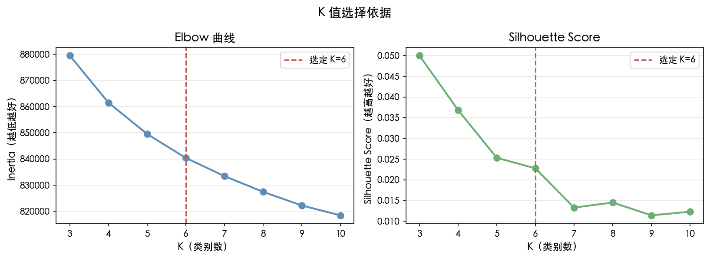
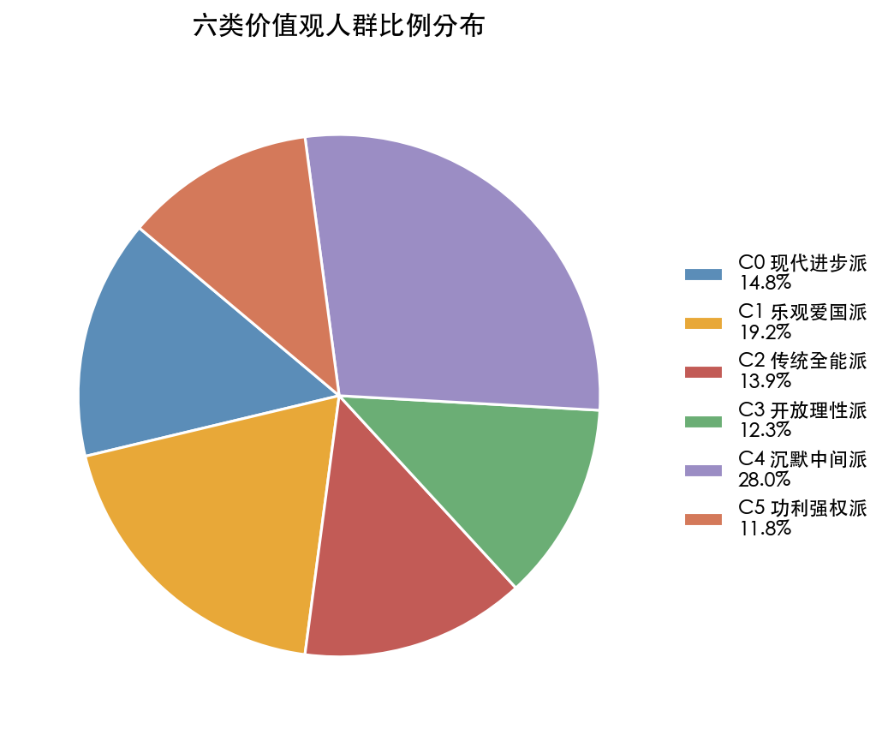
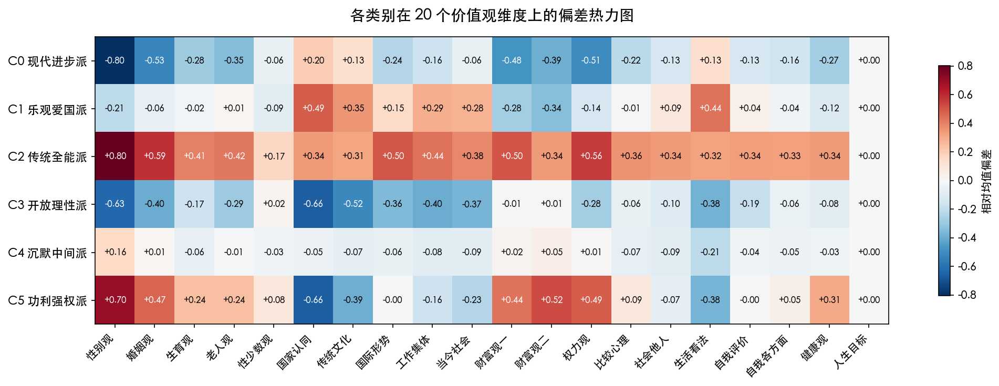
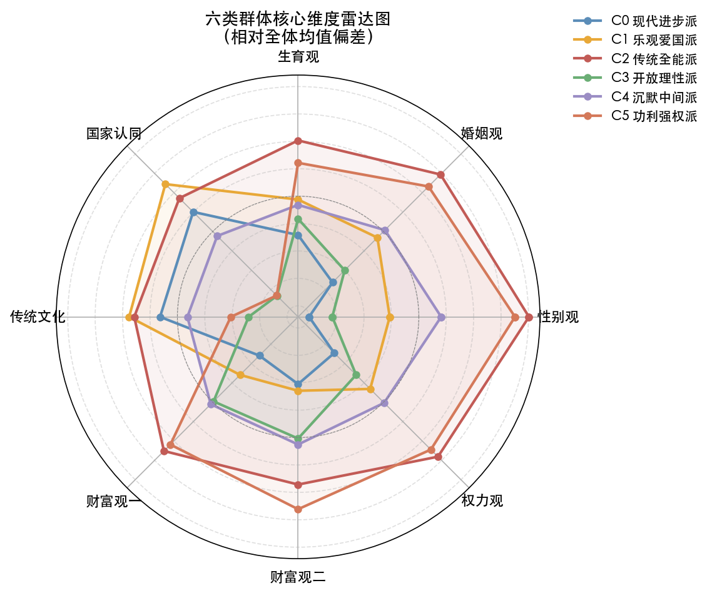
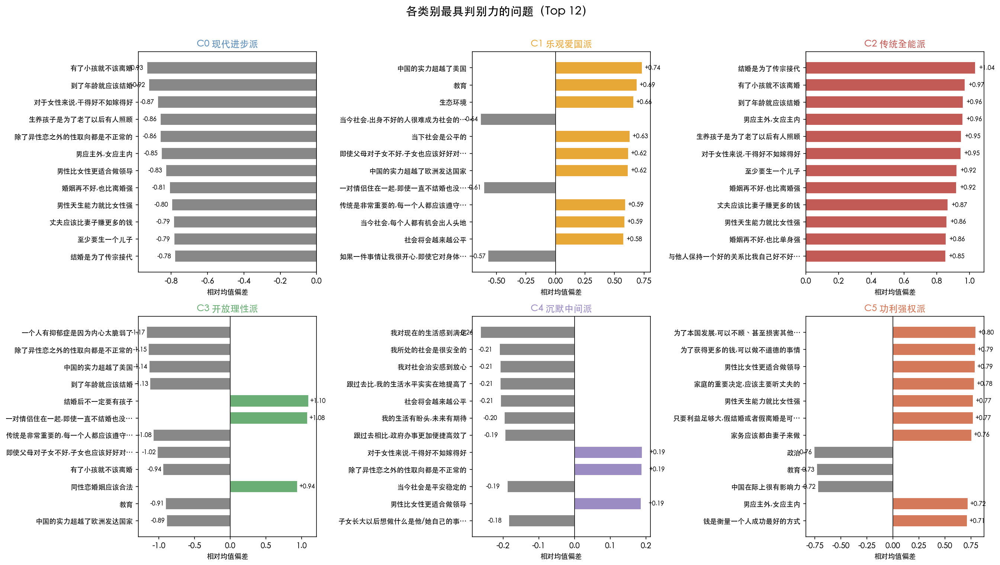

# 中国人价值观聚类分析报告

## 分析方法

**数据来源**：5850 名受访者，筛选后保留 166 个 Likert 量表字段，涵盖 20 个价值观维度。

**方法**：K-means 聚类 + Group-level 归一化

- 对每个价值观 group 内的字段独立标准化，使财富观、自我评价等弱势维度与国家认同、婚育观等强势维度具有同等权重
- 测试 K=3 到 K=10，综合 Inertia（Elbow 法）、Silhouette Score 和语义可解释性，选定 **K=6**

| K | Inertia | Silhouette |
|---|---|---|
| 3 | 879,548 | 0.0500 ← 数学最优 |
| 4 | 861,540 | 0.0369 |
| 5 | 849,569 | 0.0253 |
| **6** | **840,419** | **0.0228** ← 选定 |
| 7 | 833,468 | 0.0133 |
| 8 | 827,450 | 0.0145 |



### K 值选择讨论

**两个指标的含义**

- **Silhouette Score**：衡量每个点与自身所在类的紧密程度 vs 与相邻类的距离，越高越好。本数据中单调下降，K=3 数学最优。
- **Inertia（Elbow）**：衡量类内总方差，越低越好。本数据中持续平缓下降，**没有明显拐点**，无法从中读出自然的最优 K。

**为什么不选 K=3**

Silhouette 最高的 K=3 对应的三类人群语义过于粗糙：
- 一类"全面保守"（含传统型、功利型，两种截然不同的人被合并）
- 一类"进步"（含个人价值观进步和社会批判两种不同动机）
- 一类"国家认同低"（无法区分理性评估与情感疏离）

这三类对于理解中国人价值观差异信息量严重不足。

**两个指标整体偏低的含义**

Silhouette 最高仅 0.05，Inertia 无明显拐点，共同说明：**这份数据在价值观空间中没有天然的硬边界**，人群是连续分布的而非离散成几个团簇。这本身是一个重要发现——中国人的价值观呈现光谱状分布，而非几个截然对立的阵营。

**K=6 的选择逻辑**

在这种"没有自然聚类结构"的数据上，K 的选择本质是一个**语义权衡**而非数学问题：K 越小越粗糙，K 越大类别越难区分且越不稳定。逐一检验 K=4 到 K=8 的语义结果后，K=6 满足以下条件：

1. **每个类都有清晰且独特的主导特征**，不与其他类高度重叠
2. **每个类的规模合理**（最小 11.8%，最大 28%），没有过于稀小的噪音类
3. **增加到 K=7 后**，新增的类是对已有类的细分而非真正新的人群类型，边际信息量下降明显

因此 K=6 是在"语义丰富度"和"类别稳定性"之间的合理权衡点，而非数学意义上的最优解。

---

## 六类价值观人群

### 整体比例



| 类别 | 标签 | 比例 | 人数 |
|---|---|---|---|
| C0 | 现代进步派 | 14.8% | 868 |
| C1 | 乐观爱国派 | 19.2% | 1122 |
| C2 | 传统全能派 | 13.9% | 815 |
| C3 | 开放理性派 | 12.3% | 718 |
| C4 | 沉默中间派 | 28.0% | 1637 |
| C5 | 功利强权派 | 11.8% | 690 |

---

### C0 · 现代进步派（14.8%）

**核心特征**：个人价值观高度现代化，反传统、反权威、反物质主义，但保留一定国家认同。

**各维度偏差（相对全体均值）**：

| 维度 | 偏差 | 方向 |
|---|---|---|
| 性别观 | -0.80 | 极度进步 |
| 婚姻观 | -0.53 | 强烈反传统 |
| 对权力的看法 | -0.51 | 反权威 |
| 财富观（一） | -0.48 | 反物质主义 |
| 生育观 | -0.28 | 不强调生育义务 |
| 对健康的看法 | -0.27 | 心理健康意识强 |
| 对中国的看法 | +0.20 | 轻微正向 |

**最显著题目**：
- 强烈反对"有了小孩就不该离婚"（1.58 vs 2.51）
- 强烈反对"到了年龄就应该结婚"（2.00 vs 2.93）
- 强烈反对"干得好不如嫁得好"（1.70 vs 2.57）
- 强烈反对"生养孩子是为了老了以后有人照顾"（1.65 vs 2.51）
- 强烈反对"除了异性恋之外的性取向都是不正常的"（1.85 vs 2.71）
- 反对"钱是衡量一个人成功最好的方式"（1.85 vs 2.62）

**人群画像**：拒绝传统性别角色和婚育规范，强调个人选择自由，对心理健康无污名化，对权威保持距离，但并不强烈反对国家本身。

---

### C1 · 乐观爱国派（19.2%）

**核心特征**：高度认同国家与传统文化，对社会现状乐观，反物质主义，自信心强。

**各维度偏差**：

| 维度 | 偏差 | 方向 |
|---|---|---|
| 对中国的看法 | +0.49 | 强烈认同 |
| 对生活的看法 | +0.44 | 高度满足 |
| 传统文化 | +0.35 | 自豪感强 |
| 工作和集体 | +0.29 | 重视集体价值 |
| 对当今社会 | +0.28 | 乐观公平感 |
| 财富观（一） | -0.28 | 反物质主义 |
| 财富观（二） | -0.34 | 反物质主义 |
| 性别观 | -0.21 | 偏进步 |

**最显著题目**：
- "中国的实力超越了美国"认同度高（4.01 vs 3.27）
- 认为"当今社会是公平的"（3.76 vs 3.13）
- 认为"每个人都有机会出人头地"（4.44 vs 3.85）
- 认为"社会将会越来越公平"（4.14 vs 3.56）
- 不认为"出身不好的人很难成为上层"（2.40 vs 3.03）
- 强烈认同"传统是非常重要的"（4.60 vs 4.00）
- 自我能力信心高（4.40 vs 3.90）

**人群画像**：对国家发展充满信心，相信社会公平，对个人奋斗抱有乐观态度，同时重视传统文化，但并不保守于性别和婚育观念，财富观念也相对淡泊。

---

### C2 · 传统全能派（13.9%）

**核心特征**：全面的传统价值观，各维度均偏保守，无明显短板，是最典型的传统主义群体。

**各维度偏差**：

| 维度 | 偏差 | 方向 |
|---|---|---|
| 性别观 | +0.80 | 极度保守 |
| 对权力的看法 | +0.56 | 服从权威 |
| 婚姻观 | +0.59 | 强烈传统 |
| 国际形势 | +0.50 | 国际乐观 |
| 财富观（一） | +0.50 | 物质导向 |
| 工作和集体 | +0.44 | 集体主义 |
| 生育观 | +0.41 | 重视传宗接代 |
| 对老人的看法 | +0.42 | 强调孝道 |
| 自我评价 | +0.34 | 自我满意度高 |
| 财富观（二） | +0.34 | 物质导向 |

**最显著题目**：
- "结婚是为了传宗接代"（3.18 vs 2.14）
- "有了小孩就不该离婚"（3.49 vs 2.51）
- "到了年龄就应该结婚"（3.89 vs 2.93）
- "男应主外，女应主内"（3.43 vs 2.47）
- "生养孩子是为了老了以后有人照顾"（3.46 vs 2.51）
- "干得好不如嫁得好"（3.52 vs 2.57）
- "至少要生一个儿子"（2.98 vs 2.06）
- "靠脑力劳动的人比靠体力劳动的人对社会贡献更大"（3.27 vs 2.50）

**人群画像**：全方位的传统主义者，认同性别分工、婚姻稳定、传宗接代、孝道文化，同时也有物质追求和权威服从倾向，对中国实力和国际形势持乐观态度。

---

### C3 · 开放理性派（12.3%）

**核心特征**：思想开放（性别平等、LGBT 友好、反传统婚育），对中国现状评估偏理性保守，强调个人权利边界。

**各维度偏差**：

| 维度 | 偏差 | 方向 |
|---|---|---|
| 对中国的看法 | -0.66 | 理性评估，偏低 |
| 性别观 | -0.63 | 高度进步 |
| 传统文化 | -0.52 | 不强调传统 |
| 婚姻观 | -0.40 | 反传统婚姻观 |
| 对生活的看法 | -0.38 | 满足感偏低 |
| 工作和集体 | -0.40 | 个人导向 |
| 对当今社会 | -0.37 | 批判意识强 |
| 财富观 | ~0 | 接近均值 |

**最显著题目**：
- 强烈反对"一个人有抑郁症是因为内心太脆弱了"（1.72 vs 2.90）
- 强烈反对"除了异性恋之外的性取向都是不正常的"（1.56 vs 2.71）
- "中国的实力超越了美国"认同度低（2.13 vs 3.27）
- 强烈反对"到了年龄就应该结婚"（1.80 vs 2.93）
- 强烈支持"结婚后不一定要有孩子"（3.94 vs 2.85）
- 支持"同性恋婚姻应该合法"（3.76 vs 2.81）
- 认为"传统是非常重要的"认同度低（2.92 vs 4.00）
- 反对"即使父母对子女不好，子女也应该好好对待他们"（2.54 vs 3.56）

**人群画像**：受过良好教育、思想独立开放的群体，在社会议题上持进步立场（性别、LGBT、心理健康），对权威和传统保持批判距离，对中国实力的评估较为理性而非情绪化，对生活现状的满足感偏低反映了一定的社会批判意识。

---

### C4 · 沉默中间派（28.0%）

**核心特征**：规模最大的群体，各维度均接近全体均值，无强烈立场，生活满足感略低于平均。

**各维度偏差**：

| 维度 | 偏差 | 方向 |
|---|---|---|
| 对生活的看法 | -0.21 | 满足感略低 |
| 性别观 | +0.16 | 轻微传统 |
| 所有其他维度 | ±0.09 以内 | 接近均值 |

**最显著题目**：
- "我对现在的生活感到满足"略低（3.38 vs 3.64）
- "我的生活水平实实在地提高了"略低（3.98 vs 4.19）
- "社会将会越来越公平"略低（3.35 vs 3.56）
- 偏向认同"男性比女性更适合做领导"（2.61 vs 2.43）
- 各价值观题目均接近全体平均

**人群画像**：没有鲜明价值观立场的最大群体，在各议题上均持中间态度。生活满足感略低可能反映了日常压力，但不构成强烈批判意识。在性别议题上轻微偏传统，但整体温和。

---

### C5 · 功利强权派（11.8%）

**核心特征**：性别保守、物质导向、道德功利主义，同时对中国现状评估偏低，形成独特的"强权功利"组合。

**各维度偏差**：

| 维度 | 偏差 | 方向 |
|---|---|---|
| 性别观 | +0.70 | 强烈保守 |
| 财富观（二） | +0.52 | 强烈物质/功利 |
| 对权力的看法 | +0.49 | 服从强权 |
| 婚姻观 | +0.47 | 传统但功利 |
| 财富观（一） | +0.44 | 物质导向 |
| 对健康的看法 | +0.31 | 功利健康观 |
| 对中国的看法 | -0.66 | 评估偏低 |
| 传统文化 | -0.39 | 不重视传统 |
| 对生活的看法 | -0.38 | 满足感低 |
| 对当今社会 | -0.23 | 社会不满 |

**最显著题目**：
- "为了本国发展，可以不顾甚至损害其他国家的利益"认同度高（2.69 vs 1.89）
- "为了获得更多的钱，可以做不道德的事情"认同度高（2.21 vs 1.42）
- "男性比女性更适合做领导"（3.22 vs 2.43）
- "家庭的重要决定，应该主要听丈夫的"（2.92 vs 2.14）
- "钱是衡量一个人成功最好的方式"（3.33 vs 2.62）
- "穷人比坏更可耻"（2.41 vs 1.72）
- 对"中国实力"评估偏低（政治、教育、文化各维度均低）
- "作为一名中国人，我觉得非常自豪"认同度低（3.97 vs 4.67）

**人群画像**：以利益和强权为核心逻辑的群体。性别上极度保守，婚姻观念功利化（假结婚/假离婚接受度高），财富观念强调金钱至上甚至不道德手段，同时对国家现状评估低、生活满足感差，形成一种"不满现实但以强权逻辑应对"的独特心态。与传统全能派（C2）的区别在于：C2 是真诚的传统主义者，C5 是工具性地使用传统框架。

---

---

## 维度概览







---

## 关键发现

### 1. 最大分歧维度

**性别观**是区分各类群体的最强维度（C0/C3 极度进步，C2/C5 极度保守，spread 约 1.5 个标准单位），其次是婚育观和国家认同评估。

### 2. 财富观的独立性

财富观（物质主义程度）与其他维度的关联较弱，形成相对独立的轴：
- C1（乐观爱国派）：爱国 + 反物质主义
- C5（功利强权派）：不爱国 + 强物质主义
- C2（传统全能派）：传统 + 中等物质主义

### 3. 国家认同与传统的分离

C3（开放理性派）在国家认同评估上偏低，但这并非"不爱国"，而是对国家实力持更理性、保守的估计。C5（功利强权派）同样国家认同评估低，但原因是生活不满和社会批判，两者性质不同。

### 4. 沉默中间派的规模

C4 占比 28%，是最大的单一群体，反映了大量中国人在价值观上的非极化特征，这对理解中国社会舆论的形成具有重要意义。

---

## 各类群比例汇总

```
C4 沉默中间派  ████████████████████████████  28.0%
C1 乐观爱国派  ███████████████████           19.2%
C0 现代进步派  ██████████████                14.8%
C2 传统全能派  █████████████                 13.9%
C3 开放理性派  ████████████                  12.3%
C5 功利强权派  ███████████                   11.8%
```
